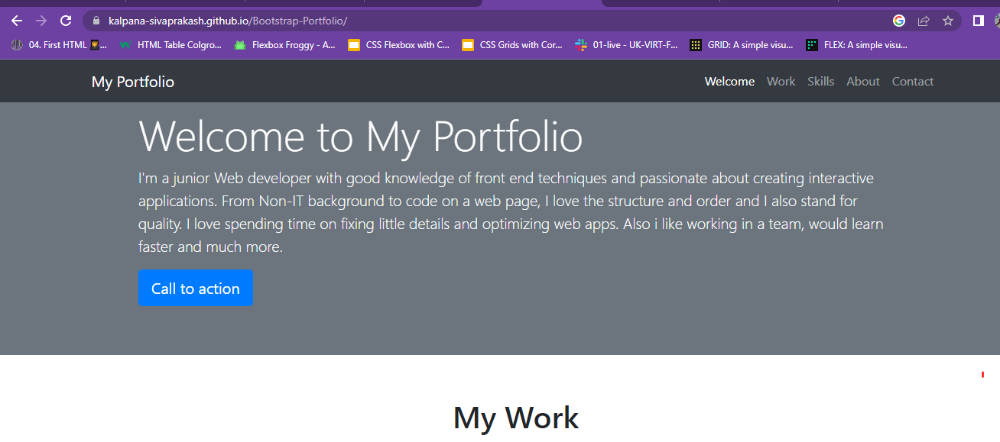
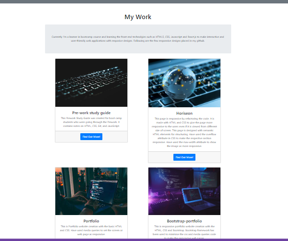

# Bootstrap-Portfolio

## Description

Have updated the Portfolio website with Bootstrap framework including navigation bar for the menu, cards for the project details, jumbotron for highlighted section and everything in the bootstrap container.

With this framework, personalised media queries has been avoided since bootstrap provides inbuilt media screen query for all screens size.

# Deployed Link:

# Repository Link:

## Installation
N/A

## Usage 
It is the Portfolio designed with bootstrap framework, responsive in all the screen sizes without the use of media query in CSS. Have attached the portfolio screenshots below.

## Credits
N/A

## License
MIT license

## Features
N/A

## Contributing
N/A
